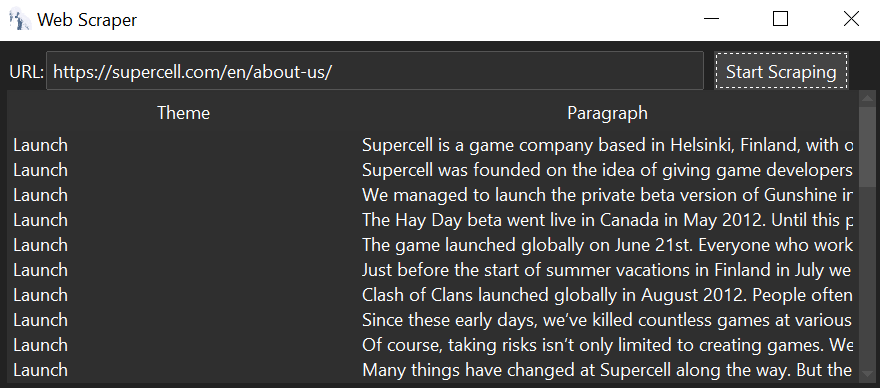
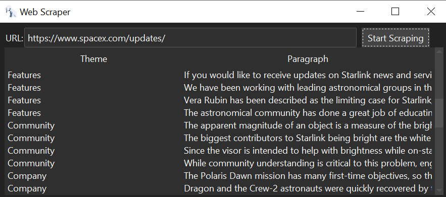
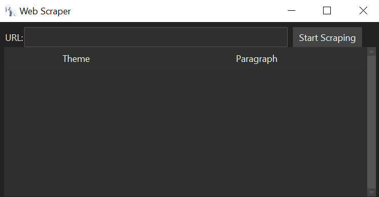

# Algorithmic Web Scraper with Theme Classification

## Description

This project is an algorithmic web scraper that extracts text from web pages and classifies paragraphs into specific themes. It uses a modern graphical interface to allow users to enter a URL and view the organized results in an interactive table.

## Technologies Used

- **Python**: Main programming language.
- **Requests**: For making HTTP requests.
- **BeautifulSoup**: For parsing HTML.
- **Pandas**: For data manipulation and organization.
- **ttkbootstrap**: For creating a modern graphical interface.
- **Tkinter**: For handling messages and managing images.
- **PIL (Pillow)**: For handling and displaying images in the graphical interface.

## Features

### Web Scraping

1. Makes a GET request to the URL.
2. Parses the HTML content to extract paragraphs.
3. Classifies the paragraphs into themes based on predefined keywords.
4. Returns a DataFrame with the paragraphs organized by theme.

### Graphical Interface

The application provides a simple and modern graphical interface:
- **URL Entry**: Allows the user to input the URL of the web page to scrape.
- **Scraping Button**: Starts the scraping process.
- **Results Table**: Displays the extracted and classified paragraphs in an interactive table.

## How It Works

1. **URL Input**: The user enters the URL in the graphical interface.
2. **Scraping**: The application makes a request to the URL, parses the HTML, and extracts paragraphs.
3. **Classification**: The paragraphs are classified into themes using predefined keywords.
4. **Visualization**: The results are displayed in a table within the graphical interface.

## Real-World Applications

- **AI Training**: Facilitates the creation of datasets for training natural language processing models.
- **Content Analysis**: Useful for extracting and analyzing content from news sites, blogs, and other web pages.
- **Market Research**: Allows for the collection of data on products, trends, and consumer opinions.

## Example Outputs

### Example 1: Scraping Results

### Example 2: Themed Paragraphs

### Interface

## Contributions

Contributions are welcome. Please open an issue to discuss any changes you would like to make.
